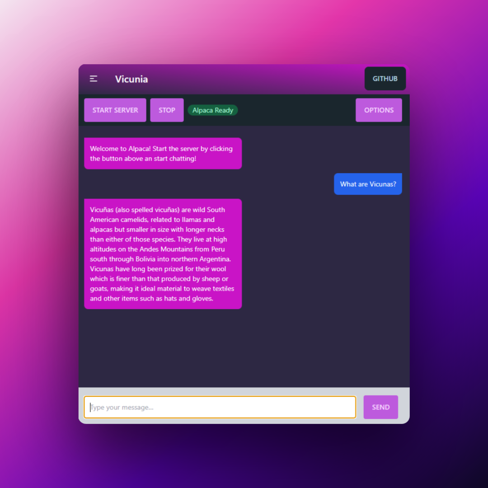

# Vicunia - Alpaca.cpp Chat Frontend and Tooling

Vicunia is a frontend for using [alpaca.cpp](https://github.com/antimatter15/alpaca.cpp) and providing a GUI for installing and chatting with Stanford Alpaca and other models from the `llama.cpp` family. It's available for Windows, Linux and Mac

## Download

See [releases](https://github.com/EliasVincent/vicunia/releases) for the latest version.

## Setup Automatic (v2.0+)

- Go to the "Setup" tab
- Click "Download Model"
- In the options menu in the chat tab, make sure the path points to the correct folder (vicunia root dir + resources/models)

> On Windows, the vicunia root dir looks something like this: `C:\Users\yourusername\AppData\Local\Programs\vicunia`

## Setup Manual

**Follow the guide on** [alpaca.cpp](https://github.com/antimatter15/alpaca.cpp)!

TL;DR: have a working and **compiled** alpaca.cpp folder with a model in your OS home directory (Windows: `C:\Users\%USERNAME%\alpaca.cpp`, Linux: `/home/%USERNAME%/alpaca.cpp`, macOS: `/Users/%USERNAME%/alpaca.cpp`). The compiled binaries (chat.exe, etc..) and model should be in the root of the alpaca.cpp folder.

## Troubleshooting

- If current Alpaca.cpp throws errors, [I have tested branches on my fork](https://github.com/EliasVincent/alpaca.cpp/branches) that work with Vicunia.
- On Windows, CPU with AVX2 support is required (at least with the included binaries).
- If you update your version, try deleting `.vicunia-settings.json` from the home folder first to avoid issues.
- Mac version is not really tested right now

Feel free to open an issue on Github!

## TODO

- more options
- markdown renderer

## How to use other .cpp forks

- rename executable to `chat` (OSX / Linux) or `chat.exe`
- have model file in same folder
- paste path to `chat` folder in the options menu

## Credits

- [alpaca.cpp](https://github.com/antimatter15/alpaca.cpp)
- [llama.cpp](https://github.com/ggerganov/llama.cpp)
- [dalai](https://github.com/cocktailpeanut/dalai)

